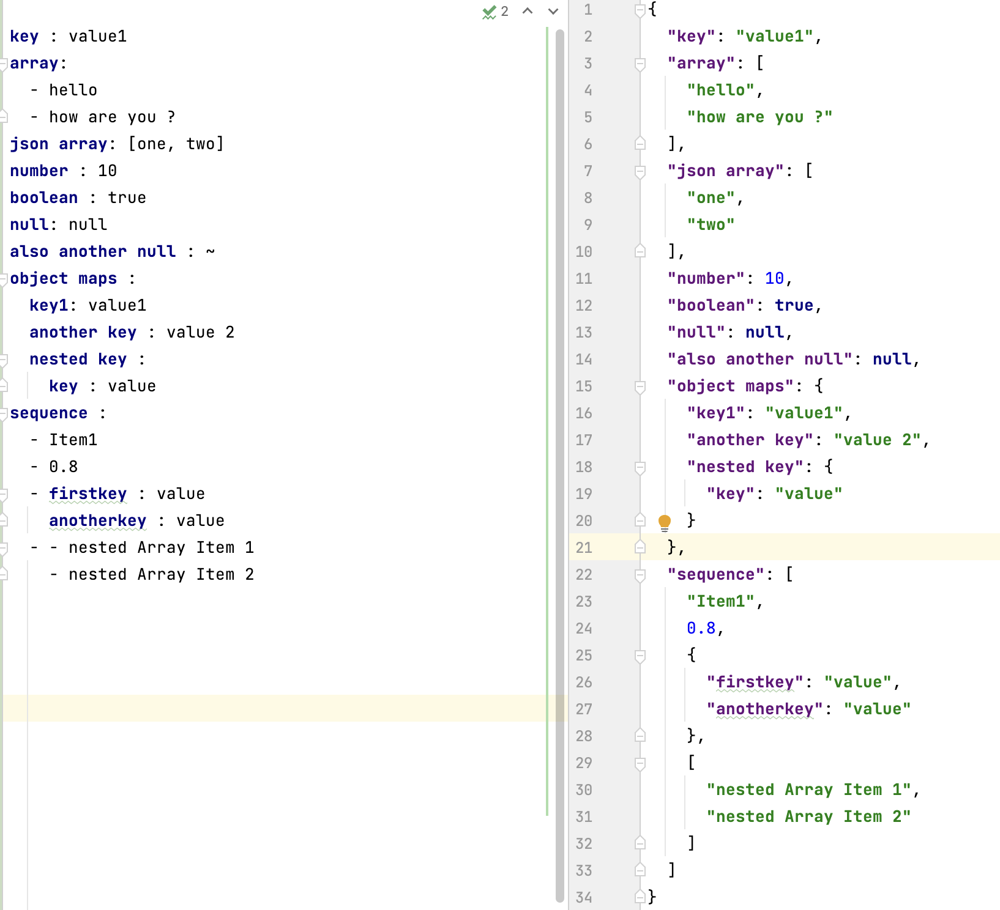

# Tech Learnings on Github Actions ( a.k.a GHA ) 
# Learn GHA 
# Pre-requisite to install 
To Install github cli run :  `brew install gh ` 

# Yaml Basics

Very simple way to learn is by compare and contrast yaml with the json format.
  
Array values start with - ( Hyphen )

### What are Events ?

These are different types of events w.r.t GHA.

- Repository Events :  Commit, Push, Pull, Request, Issue
- External Events : Calling a POST method of Rest Api call.
- Scheduled Events : Schedules everyday at some point of time.
- Manual Event : Manually triggering an event by clicking a button.

### What is a Workflow ?

A Workflow is a combination of one of more Jobs

### What is a Job ?

A Job is a combination of multiple steps which can be executed in a github hosted runner machine or self hosted runner 
machine or large runner machines.

### How to skip workflow execution ? 

In commits you can specify this in message in square bracket.
[no ci] [actions skip] [skip actions] []
